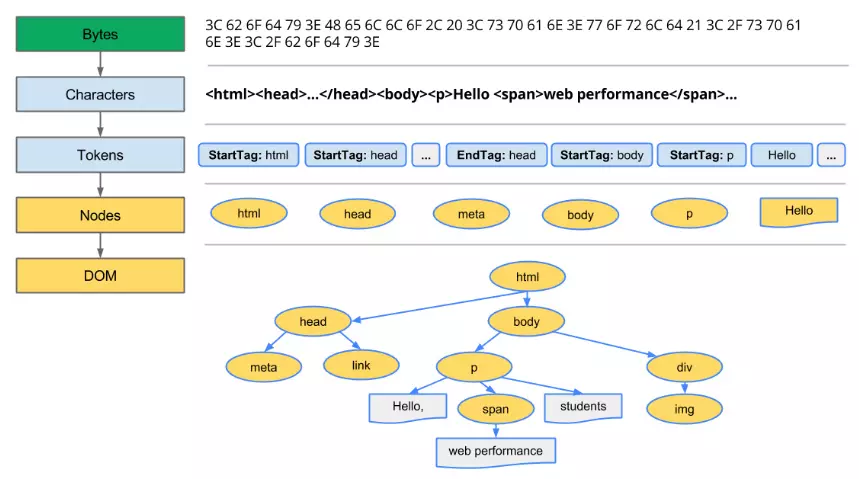

#### 整个的过程是： 
1.DNS查询
2.TCP链接
3.HTTP请求及响应
4.服务器响应
5.客户端渲染

#### 客户端渲染过程
1.处理html标记并构建DOM树（字节-> 字符-> 令牌-> 节点对象-> 对象模型）

2.处理css并构建CSSOM树
3.合并DOM和CSSDOM为渲染树
4.根据渲染树来布局，计算每个节点的几何信息
    布局阶段会从渲染树的根节点开始遍历，然后确定每个节点对象在页面上的确切大小与位置，布局阶段的输出是一
    个盒子模型，它会精确地捕获每个元素在屏幕内的确切位置与大小，所有相对的测量值也都会被转换为屏幕内的绝对像素值
5.将节点绘制到屏幕上 (不是一次执行完的) 

#### load 和 DOMContentLoaded事件的区别
DOMContentLoaded: html dom解析完毕的时候执行（由于存在阻塞，所以他的确切时间是没有的)(==jQ中的$(documt).ready(function(){})）
load: 页面的所有资源（图片，视频等）加载完毕才会执行(==jQ中的$(documt).load(function(){})）

#### 阻塞渲染： CSS/JaveScript
1.默认css被视为阻塞渲染的资源，也就是CSSOM构建完毕浏览器才会继续渲染
2.JS可以读取和修改DOM，还可以修改读取CSSOM属性，
    存在css阻塞时，浏览器停止js执行和dom构建
    a: 遇到script标签，dom构建停止，至脚本执行完
    b: JavaScript 可以查询和修改 DOM 与 CSSOM。
    c: CSSOM 构建时，JavaScript 执行将暂停，直至 CSSOM 就绪。
    
#### 所以一般页面上资源的引用顺序是
1. css优先引入
2. JS尽量少影响DOM构建，一般js引入会放在文件底部或标签底部
3. css可以通过媒体类型(media type)和媒体查询(media query)来解除渲染阻塞
    例如： 
``` bash
    <link href="index.css" rel="stylesheet">
    <link href="print.css" rel="stylesheet" media="print">
    <link href="print.css" rel="stylesheet" media="orientation:portrait">
    <link href="other.css" rel="stylesheet" media="(min-width: 30em) and (orientation: landscape)">
```
    >资源1： 加载并阻塞
    >资源2： 加载不阻塞 print只在打印网页时使用
    >资源3： 根据设备的方向加载（portrait竖屏 / landscape横屏）
    >资源4： 在符合条件时阻塞渲染
4. js === defer和async (这两个属性只对引入文件的script有效)
    a: defer属性是延迟执行引入的js,即js加载时html不停止解析，并行的，整个document解析完毕
       会依次执行defer-script中的js代码
    b: async表示异步执行引入的js async-script 可能在 DOMContentLoaded 触发之前或之后执行，但一定在 load 触发之前执行
5. 通过js添加的script资源默认是异步的，link内容则只在chrome中不阻塞渲染